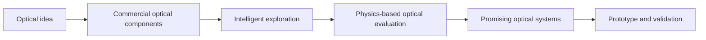
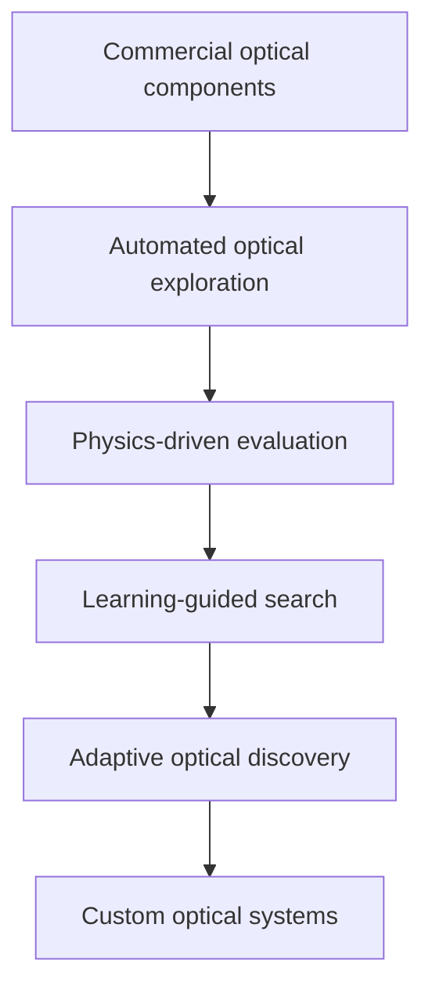

# COTS-LAMCTS

## Designing the lenses that never existed.

**Exploring a future where custom optical systems can be discovered through commercial components, intelligent search, and physics-driven evaluation.**

---

## Why this project exists

For more than a century, the creation of high-performance lenses has been one of the most specialized fields in engineering.

A new optical system traditionally requires expert optical designers, expensive simulation tools, long design cycles, and specialized manufacturing capabilities. As a result, most lenses available today come from a relatively small number of optical companies.

But modern manufacturing has created an enormous ecosystem of commercially available optical components:

- precision glass elements;
- aspherical lenses;
- optical modules;
- mechanical components.

This raises a fundamental question:

> **Can we discover new optical systems by intelligently combining what already exists?**

COTS-LAMCTS explores this possibility.

The goal is not simply to optimize a lens. The goal is to make **custom optical design more accessible, creative, and practical**.

---

# From custom cameras to custom lenses

Today, photographers and engineers can customize many parts of an imaging system:

- camera bodies;
- sensors;
- film formats;
- mechanical designs;
- digital workflows.

However, the optical design itself is usually fixed by existing product catalogs.

COTS-LAMCTS explores a different future:

> What if a small team, a researcher, or an individual creator could explore their own optical designs?

Possible applications include:

- compact lenses optimized for specific camera bodies;
- portrait lenses with unique rendering character;
- special-purpose scientific imaging systems;
- experimental optics outside traditional product categories.

---

# The core idea

Traditional lens design often starts from an ideal mathematical model and moves toward manufacturing.

COTS-LAMCTS investigates the opposite direction:

**Start from what can already be built, then intelligently discover what is possible.**

> **Intelligence guides the search. Physics decides the result.**

---

# Why COTS optics?

Commercial off-the-shelf optical components provide:

- real-world manufacturability;
- faster prototyping;
- lower development cost;
- accessible experimentation for researchers and independent creators.

Instead of asking:

> "What ideal continuous lens should be designed?"

we ask:

> "What high-quality optical systems can be discovered from what is already manufacturable?"

---

# Research direction

COTS-LAMCTS is a research framework exploring automated optical discovery under practical constraints.

The project studies the combination of:

- commercial optical components;
- large-scale optical search;
- learning-guided exploration;
- physics-based evaluation;
- practical prototype development.

The goal is not to replace optical engineers, but to create new tools that allow more people to participate in optical innovation.

---

# Research roots

This project is inspired by the original **Lens Factory** work:

**Sun, Libin, Brian Guenter, Neel Joshi, Patrick Therien, and James Hays.**  
*Lens Factory: Automatic Lens Generation Using Off-the-shelf Components.*  
2015.  
https://arxiv.org/abs/1506.08956

Lens Factory demonstrated that useful optical systems could be automatically generated from off-the-shelf optical elements by combining discrete search and optimization.

COTS-LAMCTS builds on this vision by exploring larger-scale search, learning-guided discovery, and physically grounded autonomous optical exploration.

---

# Roadmap

Current milestones:

- [x] Establish a COTS optical search framework
- [x] Build automated experiment infrastructure
- [x] Validate learning-guided optical exploration
- [ ] Develop adaptive self-improving search
- [ ] Expand optical representations and catalogs
- [ ] Demonstrate practical custom optical assemblies

---

# Documentation

Technical documentation:

- `docs/workstation_github_bridge_access.md`
- `docs/workstation_takeover_optv1_meta10k.md`

---

# Vision

The next transformation in imaging may not only come from better sensors or better algorithms.

It may come from discovering new optics.

> **The next interesting lens does not have to come from a traditional lens factory.**

---

Research project by **Wang Teng**.

Exploring the intersection of:

- computational optics;
- optical engineering;
- artificial intelligence;
- creative imaging systems.
